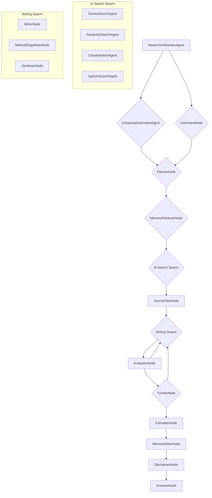
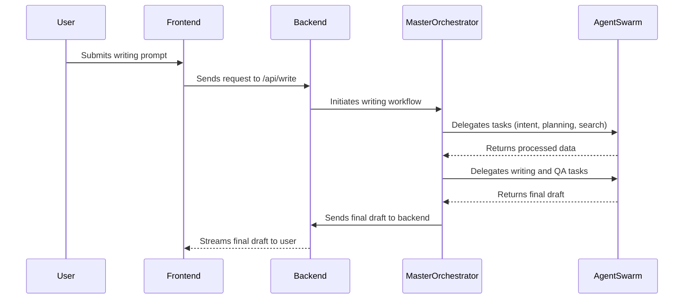
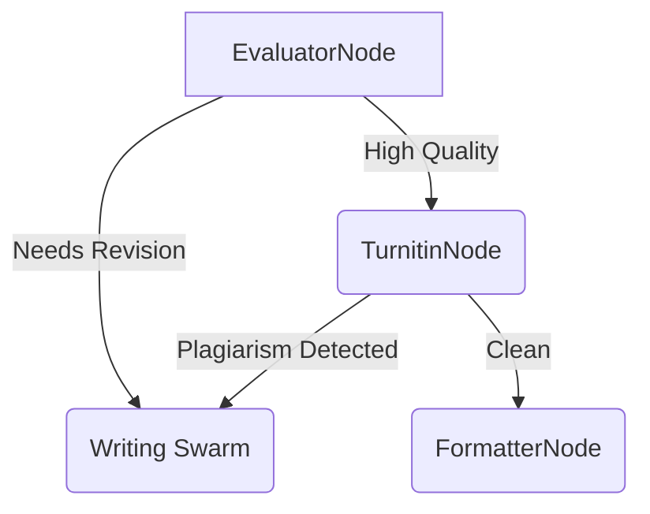
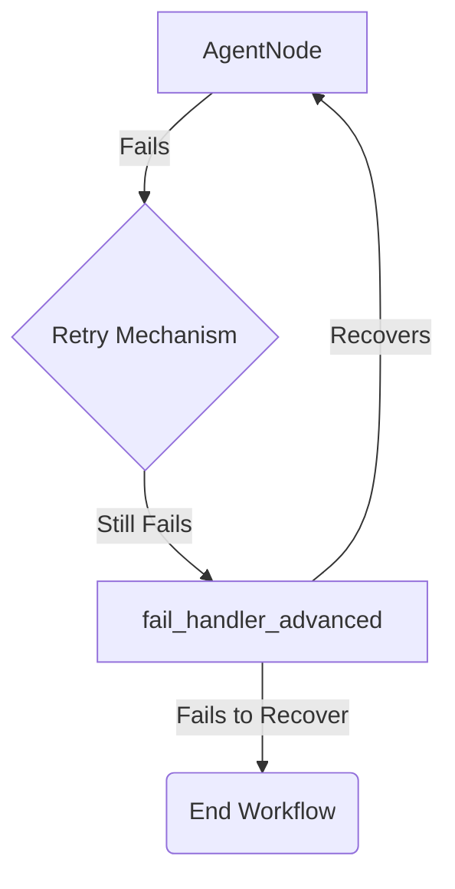

# HandyWriterz Agent Ecosystem: A Comprehensive Guide

This document provides a meticulous documentation of the HandyWriterz agent ecosystem, mapping all agents with their specific roles, responsibilities, and technical specifications.

## 1. Agent Hierarchy and Relationships

The HandyWriterz ecosystem is a sophisticated multi-agent system designed for academic writing. The agents are organized in a hierarchical structure, with the `MasterOrchestratorAgent` at the top, coordinating the workflow between various specialized agents and swarms.

## 2. Agent Roles and Responsibilities

### 2.1. Orchestration Agents

*   **MasterOrchestratorAgent:** The central coordinator of the entire workflow. It initializes the process, delegates tasks to other agents, and ensures the smooth execution of the writing process.
*   **EnhancedUserIntentAgent:** A sophisticated agent that analyzes the user's prompt to understand their true intent, even if it's not explicitly stated. It can ask clarifying questions to ensure the final output meets the user's needs.
*   **UserIntentNode:** A simpler version of the `EnhancedUserIntentAgent` that performs a basic analysis of the user's prompt.
*   **PlannerNode:** Creates a detailed plan for the writing process, including the research questions, the structure of the document, and the agents that will be involved.

### 2.2. Memory Agents

*   **MemoryRetrieverNode:** Retrieves the user's writing fingerprint from the database to ensure the generated content matches their style.
*   **MemoryWriterNode:** Updates the user's writing fingerprint with the metrics from the latest draft.

### 2.3. Search Agents & Swarms

*   **AI Search Swarm:** A swarm of specialized search agents that gather information from various sources, including academic databases, web search, and specific platforms like GitHub.
    *   **GeminiSearchAgent:** Uses Google's Gemini model for advanced knowledge synthesis.
    *   **PerplexitySearchAgent:** Performs real-time academic search with source validation.
    *   **ClaudeSearchAgent:** Leverages Anthropic's Claude model for nuanced understanding and search.
    *   **OpenAISearchAgent:** Utilizes OpenAI's models for broad web search.
*   **SourceFilterNode:** Filters the search results to ensure only high-quality, credible sources are used in the writing process.

### 2.4. Writing Agents & Swarms

*   **Writing Swarm:** A swarm of specialized writing agents that collaborate to produce the final draft.
    *   **WriterNode:** The main writing agent that generates the body of the text.
    *   **MethodologyWriterNode:** A specialized agent that writes the methodology section of a research paper.
    *   **SynthesisNode:** Synthesizes information from multiple sources to create a coherent narrative.

### 2.5. Quality Assurance Agents

*   **EvaluatorNode:** A multi-model evaluator that assesses the quality of the draft based on various criteria, including clarity, coherence, and academic rigor.
*   **TurnitinNode:** Checks the draft for plagiarism and AI-generated content using the Turnitin API.

### 2.6. Post-Processing Agents

*   **FormatterNode:** Formats the final draft according to the user's specified citation style and document type.
*   **DerivativesNode:** Generates derivative content from the final draft, such as presentation slides and charts.
*   **ArweaveNode:** Uploads the final document to Arweave to create an immutable authorship proof.

## 3. Request Processing Workflow

The following diagram illustrates the high-level workflow for processing a user request:

## 4. Decision Pathways for Complex Scenarios

The HandyWriterz ecosystem is designed to handle complex scenarios with intelligent decision-making. For example, if the `EvaluatorNode` determines that the draft requires significant revisions, it will be sent back to the `Writing Swarm` for another iteration. Similarly, if the `TurnitinNode` detects plagiarism, the draft will be revised until it passes the check.

## 5. Error Handling and Recovery

Each agent node is equipped with robust error handling and recovery mechanisms. If a node fails, it will attempt to retry the operation multiple times with an exponential backoff strategy. If the error persists, the `fail_handler_advanced` node is invoked to diagnose the issue and attempt a graceful recovery.

## 6. Data Flow Between Components

The following diagram illustrates the data flow between the main components of the system:

## 7. Agent Tools

The agents have access to a variety of tools to perform their tasks. These tools are implemented as Python classes and are invoked by the agents as needed.

| Tool                      | API                               | Input                               | Output                                |
| ------------------------- | --------------------------------- | ----------------------------------- | ------------------------------------- |
| **GitHubIssuesTool**      | `get_open_issues(repo_name)`      | Repository name (e.g., "user/repo") | List of open issues                   |
| **CASPAppraisalTool**     | `appraise_studies(studies)`       | List of academic studies            | Pandas DataFrame with appraisal results |
| **MermaidDiagramTool**    | `generate_prisma_diagram(counts)` | PRISMA flow diagram counts          | Mermaid diagram string                |
| **GibbsFrameworkTool**    | `apply_framework(text)`           | Reflective text                     | Structured reflection based on Gibbs' cycle |
| **ActionPlanTemplateTool**| `create_plan(goals)`              | List of goals                       | Formatted action plan                 |
| **CaseStudyFrameworkTool**| `analyze_case(case_text)`         | Case study text                     | Structured analysis of the case       |
| **CostModelTool**         | `estimate_cost(params)`           | Job parameters (word count, etc.)   | Estimated cost of the job             |

## 8. Method-Chaining-Prompting (MCP)

HandyWriterz utilizes a custom implementation of Method-Chaining-Prompting (MCP) to enable autonomous capabilities. This involves creating a sequence of prompts that are chained together, with the output of one prompt serving as the input for the next. This allows the agents to perform complex, multi-step tasks without human intervention.

The MCP implementation is structured as follows:

1.  **Initial Prompt:** The user's initial prompt is used to kick off the MCP chain.
2.  **Agent Selection:** The `MasterOrchestrator` selects the appropriate agent for the first step of the task.
3.  **Prompt Generation:** The selected agent generates a prompt for the LLM.
4.  **LLM Invocation:** The LLM is invoked with the generated prompt.
5.  **Output Parsing:** The output of the LLM is parsed and used to determine the next step in the chain.
6.  **Next Agent Selection:** The `MasterOrchestrator` selects the next agent based on the output of the previous step.
7.  **Loop:** Steps 3-6 are repeated until the task is complete.

This MCP implementation is integrated into the `handywriterz_graph.py` file and is the core of the autonomous capabilities of the HandyWriterz ecosystem.

## 9. Practical Implementation Scenarios

### Scenario 1: Simple Request

**Request:** "Write a short summary of the impact of AI on healthcare."

1.  **Raw Request Parsing:** The request is parsed by the `EnhancedUserIntentAgent`.
2.  **Intent Extraction:** The agent identifies the intent as a simple summarization task.
3.  **Agent Activation Sequence:** The `MasterOrchestrator` activates the `GeminiSearchAgent` to gather information and the `RAGSummarizerNode` to create the summary.
4.  **Response Formulation:** The `RAGSummarizerNode` formulates the final response.
5.  **Output Validation:** The output is validated for quality and accuracy.

### Scenario 2: Complex Request

**Request:** "Write a 5000-word dissertation on the ethical implications of autonomous weapons, with a focus on international law. Use the APA citation style."

1.  **Raw Request Parsing:** The request is parsed by the `EnhancedUserIntentAgent`.
2.  **Intent Extraction:** The agent identifies the intent as a complex dissertation writing task with specific requirements.
3.  **Agent Activation Sequence:** The `MasterOrchestrator` activates a complex workflow involving the `PlannerNode`, `AI Search Swarm`, `SourceFilterNode`, `Writing Swarm`, `EvaluatorNode`, `TurnitinNode`, and `FormatterNode`.
4.  **Inter-agent Communication:** The agents communicate with each other through the shared state object, passing data and results between them.
5.  **Tool Utilization:** The `AI Search Swarm` utilizes various search tools to gather information, and the `FormatterNode` uses the `csl.py` utility to format the citations.
6.  **Response Formulation:** The `Writing Swarm` collaborates to formulate the final draft.
7.  **Output Validation:** The `EvaluatorNode` and `TurnitinNode` validate the output for quality and academic integrity.

## 10. System Limitations and Future Improvements

### Limitations

*   **Cost:** The use of multiple powerful AI models can be expensive.
*   **Speed:** Complex workflows can take a significant amount of time to complete.
*   **Factuality:** While the system is designed to use credible sources, there is always a risk of factual inaccuracies.

### Future Improvements

*   **Architectural Enhancements:**
    *   Implement a more sophisticated caching mechanism to reduce redundant API calls.
    *   Explore the use of smaller, more specialized models for specific tasks to reduce cost and improve speed.
*   **Additional Capabilities:**
    *   Add support for more languages.
    *   Integrate with more academic databases and platforms.
    *   Develop a more advanced user interface for managing and interacting with the agent ecosystem.
*   **Optimization Strategies:**
    *   Fine-tune the LLMs on a custom dataset of academic texts to improve their performance.
    *   Optimize the MCP implementation to reduce the number of steps required to complete a task.