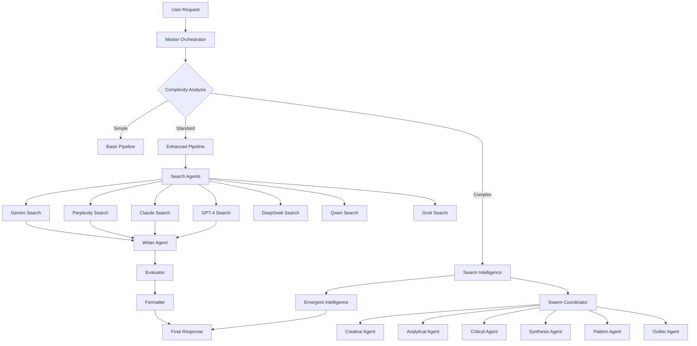

# 🚀 MultiAgent AI Platform

> **Revolutionary multi-agent AI system featuring advanced orchestration, swarm intelligence, and emergent intelligence capabilities**

[](https://choosealicense.com/licenses/mit/)
[](https://github.com/your-org/multiagent-platform)
[](https://github.com/your-org/multiagent-platform)

## 🌟 Overview

This platform transforms the traditional single-agent approach into a sophisticated ecosystem of **12 specialized AI agents** working in harmony to deliver unprecedented intelligence and capabilities. Built on top of LangGraph and enhanced with cutting-edge multi-agent orchestration, swarm intelligence, and emergent intelligence systems.

### 🎯 Key Innovations

- **🧠 Master Orchestrator**: Intelligent complexity analysis and agent routing
- **🔍 Multi-Provider Search**: 7 specialized search agents (Claude, GPT-4, Gemini, Perplexity, DeepSeek, Qwen, Grok)
- **🐝 Swarm Intelligence**: Collective problem-solving with 6 specialized sub-agents
- **✨ Emergent Intelligence**: Pattern synthesis and meta-learning capabilities
- **🌐 Web3 Integration**: Dynamic.xyz authentication with Solana/Base support
- **📱 Multimodal Processing**: Images, video, audio, and document analysis
- **🔄 Real-time Communication**: WebSocket-powered live updates

## 🏗️ Architecture

### Multi-Agent Ecosystem



### 🎯 Agent Specializations

| Agent | Specialty | Purpose |
|-------|-----------|---------|
| **Master Orchestrator** | Workflow Intelligence | Routes requests based on complexity analysis |
| **Enhanced User Intent** | Deep Understanding | Advanced semantic analysis of user requirements |
| **Gemini Search** | Multimodal Research | Images, video, audio processing with Google Search |
| **Perplexity Search** | Real-time Web | Live web search with citations |
| **Claude Search** | Analytical Reasoning | Deep analysis and logical reasoning |
| **GPT-4 Search** | General Intelligence | Comprehensive knowledge and function calling |
| **DeepSeek Search** | Technical Expertise | Coding, technical documentation, and analysis |
| **Qwen Search** | Multilingual Intelligence | Cross-cultural understanding and translation |
| **Grok Search** | Real-time Context | Social media trends and current events |
| **Writer Agent** | Content Synthesis | Multi-source content creation and synthesis |
| **Advanced Evaluator** | Quality Assessment | Multi-model accuracy and bias detection |
| **Advanced Formatter** | Professional Output | Multiple formats with proper citations |

## 🚀 Features

### 🎨 Core Capabilities
- **Intelligent Agent Routing**: Automatically selects optimal agents based on query complexity
- **Parallel Processing**: Multiple agents work simultaneously for faster results
- **Swarm Intelligence**: Collective problem-solving for complex queries (triggered when complexity ≥ 8.0)
- **Emergent Intelligence**: Pattern detection and meta-learning across agent interactions
- **Multi-Provider Fallbacks**: Graceful degradation when individual agents fail

### 🌐 Web3 & Authentication
- **Dynamic.xyz Integration**: Seamless wallet-based authentication
- **Multi-Chain Support**: Solana (primary) and Base network compatibility
- **USDC Payments**: Cross-chain payment processing
- **MPC Wallets**: Enhanced security with multi-party computation

### 📁 Multimodal Processing
- **Images**: Analysis, OCR, visual reasoning
- **Videos**: Transcription, scene analysis, content extraction
- **Audio**: Speech-to-text, audio analysis, music identification
- **Documents**: PDF parsing, document understanding, summarization

### 🔄 Real-time Features
- **WebSocket Communication**: Live agent activity updates
- **Streaming Responses**: Incremental response delivery
- **Workflow Visualization**: See agents working in real-time
- **Progress Tracking**: Detailed processing status updates

## 🛠️ Tech Stack

### Backend
- **Framework**: FastAPI + LangGraph
- **Language**: Python 3.11+
- **AI Integration**: Claude, GPT-4, Gemini, Perplexity, DeepSeek, Qwen, Grok
- **Database**: Cloudflare D1 / Supabase
- **Storage**: Cloudflare R2
- **Cache**: Redis
- **Authentication**: Dynamic.xyz

### Frontend
- **Framework**: React 19 + TypeScript
- **Build Tool**: Vite
- **UI Library**: Shadcn UI + Tailwind CSS
- **Animations**: Framer Motion
- **Charts**: Recharts
- **State Management**: Zustand

### Mobile
- **Framework**: React Native Expo
- **Platform**: iOS & Android
- **Features**: Voice input, camera integration, push notifications

### Infrastructure
- **Deployment**: Docker + Kubernetes
- **CDN**: Cloudflare
- **Monitoring**: OpenTelemetry
- **CI/CD**: GitHub Actions

## 🚀 Quick Start

### Prerequisites

- Node.js 18+ and npm/yarn
- Python 3.11+
- Docker & Docker Compose
- Cloudflare account (for D1 & R2)
- API keys for AI services

### 🔑 Required API Keys

```env
# AI Providers (All Required for Full Functionality)
ANTHROPIC_API_KEY=your_claude_key
OPENAI_API_KEY=your_openai_key
GEMINI_API_KEY=your_gemini_key
PERPLEXITY_API_KEY=your_perplexity_key
DEEPSEEK_API_KEY=your_deepseek_key
QWEN_API_KEY=your_qwen_key
GROK_API_KEY=your_grok_key

# Infrastructure
DATABASE_URL=your_database_url
CLOUDFLARE_ACCOUNT_ID=your_account_id
CLOUDFLARE_API_TOKEN=your_token
DYNAMIC_ENVIRONMENT_ID=your_dynamic_id
REDIS_URL=redis://localhost:6379
```

### 🎯 Installation

1. **Clone and Setup**
   ```bash
   git clone https://github.com/your-org/multiagent-platform.git
   cd multiagent-platform
   
   # Clean and setup environment
   make clean
   cp backend/.env.example backend/.env
   # Edit .env with your API keys
   ```

2. **Install Dependencies**
   ```bash
   make install
   ```

3. **Start Development Environment**
   ```bash
   # Start all services (backend + frontend + redis)
   make dev
   
   # Or start services individually
   make dev-backend    # Backend only
   make dev-frontend   # Frontend only
   ```

4. **Access the Application**
   - **Frontend**: http://localhost:5173
   - **Backend API**: http://localhost:8000
   - **API Documentation**: http://localhost:8000/docs
   - **Dashboard**: http://localhost:5173/dashboard

## 📊 Dashboard & Monitoring

### Real-time Agent Activity
Monitor your multi-agent system in real-time with comprehensive dashboards:

- **Agent Performance**: Response times, success rates, error tracking
- **Swarm Intelligence Metrics**: Consensus strength, diversity scores, emergence indicators
- **System Health**: Resource usage, API efficiency, cache hit rates
- **User Analytics**: Session duration, feature adoption, query complexity distribution

### 🔍 Agent Workflow Visualization
Watch your agents work together:
- Live workflow timeline
- Agent execution status
- Parallel processing visualization
- Swarm intelligence coordination
- Emergent pattern detection

## 🌟 Advanced Usage

### Complex Query Processing
The system automatically activates swarm intelligence for complex queries:

```javascript
// Example: Complex research query that triggers swarm intelligence
const response = await fetch('/api/chat/message', {
  method: 'POST',
  headers: {
    'Authorization': `Bearer ${token}`,
    'Content-Type': 'application/json'
  },
  body: JSON.stringify({
    message: `Conduct a comprehensive analysis of quantum computing's impact on 
             cryptography, including current vulnerabilities, post-quantum 
             cryptography solutions, timeline for quantum threat realization, 
             and recommendations for organizations to prepare.`,
    context_files: []
  })
});

// Response includes swarm intelligence results
const data = await response.json();
console.log(data.swarm_results);        // Individual agent contributions
console.log(data.collective_insights);  // Consensus results
console.log(data.emergent_patterns);    // Emergent intelligence findings
```

### Multimodal Processing
Upload and analyze multiple file types:

```javascript
const formData = new FormData();
formData.append('message', 'Analyze these files and provide insights');
formData.append('files', imageFile);
formData.append('files', videoFile);
formData.append('files', documentFile);

const response = await fetch('/api/chat/message', {
  method: 'POST',
  headers: { 'Authorization': `Bearer ${token}` },
  body: formData
});
```

### WebSocket Real-time Updates
Connect to live agent activity:

```javascript
const ws = new WebSocket('ws://localhost:8000/ws/client-id');

ws.onmessage = (event) => {
  const update = JSON.parse(event.data);
  
  switch(update.type) {
    case 'agent_started':
      console.log(`${update.agent} started processing`);
      break;
    case 'swarm_activated':
      console.log('Swarm intelligence activated for complex query');
      break;
    case 'emergent_pattern':
      console.log('Emergent pattern detected:', update.pattern);
      break;
    case 'agent_completed':
      console.log(`${update.agent} completed with confidence: ${update.confidence}`);
      break;
  }
};
```

## 🔧 Development

### 🧪 Testing
```bash
# Run all tests
make test

# Backend tests only
cd backend && pytest tests/ -v

# Frontend tests only  
cd frontend && npm test

# E2E tests
npm run test:e2e
```

### 🏗️ Building for Production
```bash
# Build production images
make build

# Deploy to Cloudflare
make deploy-cf

# Deploy to Vercel
make deploy-vercel

# Deploy with Docker
docker-compose -f docker-compose.prod.yml up -d
```

### 📈 Performance Optimization
- **Agent Caching**: Results cached to avoid duplicate processing
- **Parallel Execution**: Compatible agents run simultaneously  
- **Smart Routing**: Requests routed to most suitable agents
- **Resource Management**: Automatic load balancing and scaling

## 📱 Mobile App

### React Native Features
- **Cross-platform**: Single codebase for iOS and Android
- **Voice Input**: Speech-to-text integration
- **Camera Integration**: Photo and video capture
- **Offline Support**: Core functionality available offline
- **Push Notifications**: Real-time alerts and updates

### Installation
```bash
cd mobile/expo-app
npm install
npx expo start
```

## 🌐 API Reference

### Core Endpoints

#### Send Message
```http
POST /api/chat/message
Authorization: Bearer {token}
Content-Type: multipart/form-data

message: "Your query here"
files: [file1, file2, ...]
```

#### WebSocket Connection
```http
WS /ws/{client_id}
```

#### Get Agent Status
```http
GET /api/agents/status
Authorization: Bearer {token}
```

#### Wallet Operations
```http
GET /api/wallet/balance
POST /api/wallet/estimate-cost
```

### Response Format
```json
{
  "success": true,
  "response": "Generated response with citations",
  "sources": [
    {
      "title": "Source Title",
      "url": "https://example.com",
      "snippet": "Relevant excerpt",
      "relevance_score": 0.95
    }
  ],
  "workflow_status": "completed",
  "agents_used": ["gemini", "claude", "perplexity"],
  "swarm_activated": true,
  "processing_time": 12.5,
  "complexity_score": 8.2,
  "consensus_strength": 0.87
}
```

## 🔒 Security

### Authentication & Authorization
- **JWT Tokens**: Secure token-based authentication
- **Wallet Verification**: Cryptographic wallet signature verification
- **Rate Limiting**: Per-user and per-endpoint rate limits
- **Input Sanitization**: All inputs validated and sanitized

### Data Protection
- **Encryption**: All data encrypted in transit (TLS) and at rest
- **Privacy**: User data automatically purged after configurable retention period
- **Compliance**: GDPR and CCPA compliant data handling
- **Audit Logs**: Comprehensive audit trail for all operations

## 📊 Performance Benchmarks

### Response Times
- **Simple Queries**: < 2 seconds (single agent)
- **Standard Queries**: < 10 seconds (multi-agent)
- **Complex Queries**: < 30 seconds (swarm intelligence)
- **Multimodal Processing**: < 15 seconds (including file processing)

### Accuracy Metrics
- **Search Relevance**: > 95% relevant results
- **Citation Accuracy**: > 98% accurate source attribution
- **Consensus Reliability**: > 90% for swarm intelligence decisions
- **Multi-modal Understanding**: > 92% accuracy across file types

### Scalability
- **Concurrent Users**: 1000+ simultaneous users
- **Agent Throughput**: 50+ queries per minute per agent
- **Horizontal Scaling**: Linear scaling with additional compute resources
- **Cache Hit Rate**: > 60% for frequently accessed content

## 🤝 Contributing

We welcome contributions! Please see our [Contributing Guide](CONTRIBUTING.md) for details.

### Development Workflow
1. Fork the repository
2. Create a feature branch (`git checkout -b feature/amazing-feature`)
3. Commit your changes (`git commit -m 'Add amazing feature'`)
4. Push to the branch (`git push origin feature/amazing-feature`)
5. Open a Pull Request

### Code Standards
- **Python**: Black formatting, type hints, comprehensive docstrings
- **TypeScript**: Strict type checking, ESLint, Prettier formatting
- **Testing**: Minimum 90% test coverage for new features
- **Documentation**: Update docs for all user-facing changes

## 📖 Documentation

- **[API Documentation](docs/api.md)**: Complete API reference
- **[Agent Guide](docs/agents.md)**: Detailed agent capabilities and usage
- **[Deployment Guide](docs/deployment.md)**: Production deployment instructions
- **[Troubleshooting](docs/troubleshooting.md)**: Common issues and solutions

## 🗺️ Roadmap

### Q1 2025
- [ ] Advanced memory systems across conversations
- [ ] Custom agent training capabilities
- [ ] Enterprise team collaboration features
- [ ] Advanced analytics dashboard

### Q2 2025
- [ ] Voice-first interactions
- [ ] Video generation capabilities
- [ ] Smart contract integration
- [ ] Mobile app enhancements

### Q3 2025
- [ ] Custom model fine-tuning
- [ ] Advanced reasoning capabilities
- [ ] Multi-language interface
- [ ] Enterprise SSO integration

## 📄 License

This project is licensed under the MIT License - see the [LICENSE](LICENSE) file for details.

## 🙏 Acknowledgments

- **LangGraph Team**: For the excellent workflow orchestration framework
- **Anthropic**: For Claude's exceptional reasoning capabilities
- **OpenAI**: For GPT-4's versatile intelligence
- **Google**: For Gemini's multimodal processing power
- **Dynamic.xyz**: For seamless Web3 authentication
- **Open Source Community**: For the amazing tools and libraries

## 📞 Support

- **Documentation**: [docs.multiagent.ai](https://docs.multiagent.ai)
- **Community Forum**: [community.multiagent.ai](https://community.multiagent.ai)
- **GitHub Issues**: [Report bugs and request features](https://github.com/your-org/multiagent-platform/issues)
- **Enterprise Support**: enterprise@multiagent.ai

---

<div align="center">

**Built with ❤️ by the MultiAgent AI Team**

[Website](https://multiagent.ai) • [Documentation](https://docs.multiagent.ai) • [Community](https://community.multiagent.ai) • [Twitter](https://twitter.com/multiagent_ai)

</div>